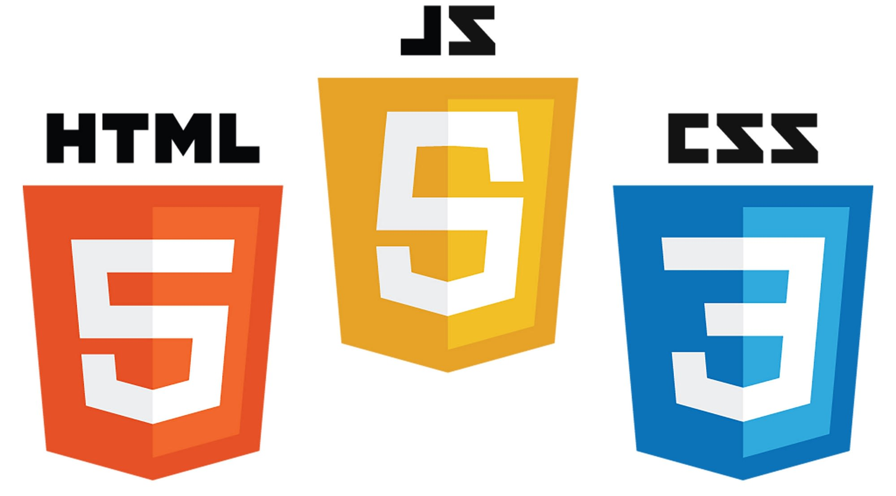

# 網頁前端工程入門筆記

Basic concept for HTML, CSS and JavaScript for beginner

---

## 學習主要資源

本學習筆記記錄如何從 0 開始學習網頁前端工程師的基礎知識，並由以下教材作為主要學習資訊：

- [JavaScript 網頁前端工程入門](https://www.youtube.com/playlist?list=PL-g0fdC5RMbpqZ0bmvJTgVTS4tS3txRVp)
- [Mozilla Web Doc - Web 入門](https://developer.mozilla.org/zh-TW/docs/Learn/Getting_started_with_the_web)

---

## 上課前須先安裝與練習準備項目

- [VSCode](https://code.visualstudio.com/)

  開發用 IDE 工具

- [Live Server](https://marketplace.visualstudio.com/items?itemName=ritwickdey.LiveServer)

  主要用於本機環境可用 VSCode 當前 workspace 資料夾快速架設(host)一個靜態網頁，能有效練習相關作業呈現

---

## 課程章節與自我練習實際操作

1. [基礎 HTML](./01_basic_html/)
2. [基礎 CSS](./02_basic_html_layout/)
3. [CSS 選擇器](./02_basic_html_layout)
4. [CSS 表格樣式](./03_css_selector)
5. [網頁排版](./04_css_table_layout)
6. 回應式(RWD, Responsive Web Design)排版設計
7. CSS3 Flexbox 排版基礎
8. CSS3 Flexbox 回應式設計 RWD 排版
9. [JavaScript - 簡介](./09_js_intro)
10. [JavaScript - 變數與運算子](./10_js_variable_and_operators)
11. [JavaScript - 流程控制 : 判斷式](./11_js_conditions)
12. JavaScript - 流程控制 : 迴圈
13. JavaScript - 函式
14. HTML DOM
15. Javascript 事件處理
16. JavaScript 自動排程
17. JavaScript AJAX
18. JSON 基本教學
19. Hoisting 變數宣告提升

## 其他學習延伸參考

- [JavaScript 101 快速入門](https://blog.techbridge.cc/2017/01/14/javascript101-tutorial/)
- [airbnb/javascript : Airbnb JavaScript Style Guide](https://github.com/airbnb/javascript)
- [kriasoft/Folder-Structure-Conventions : Folder Structure Conventions](https://github.com/kriasoft/Folder-Structure-Conventions)
- [常見變數/方法命名規則(NAMING CONVENTION)](https://dustinhsiao21.com/2019/03/14/naming-convention/)