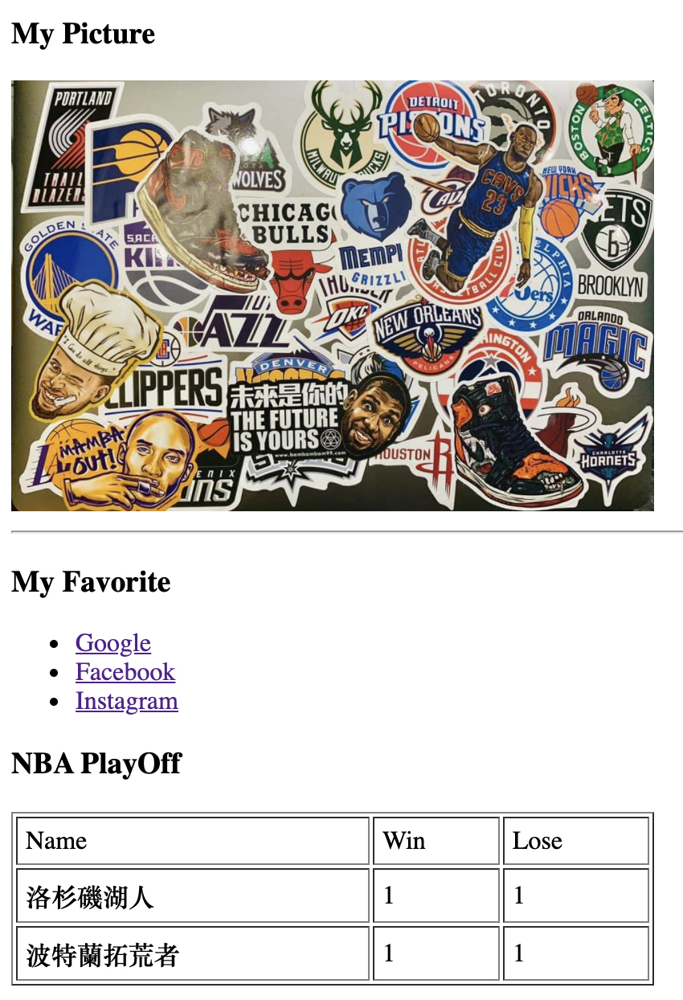

# 網頁前端工程入門：基礎 HTML 教學 By 彭彭

## 教學參考

[網頁前端工程入門：基礎 HTML 教學 By 彭彭](https://www.youtube.com/watch?v=SRbewm2AUew&list=PL-g0fdC5RMbpqZ0bmvJTgVTS4tS3txRVp&index=1)

## 學習筆記

超文本標記語言（英語：HyperText Markup Language，簡稱：HTML）是一種用於建立網頁的標準標記語言(markup language). 特色是以一個前後對應的標籤表示一個完整的最小語句(最小元素, Element)．

HTML是一種基礎技術，常與CSS、JavaScript一起被眾多網站用於設計網頁、網頁應用程式以及行動應用程式的使用者介面。網頁瀏覽器可以讀取HTML檔案，並將其彩現成視覺化網頁。HTML描述了一個網站的結構語意隨著線索的呈現，使之成為一種標記語言而非程式語言。

HTML 所包含的標籤與說明：

| 標籤      | 說明                                       |
| --------- | ------------------------------------------ |
| `<head>`  | 網頁的描述                                 |
| `<title>` | 網頁的標題                                 |
| `<body>`  | 整份網頁的內容                             |
| `
`   | 區塊(會產生斷行效果)                       |
| `style`   | 設定 HTML 文件的樣式                       |
| ``  | 行內標定修改處(不會產生斷行效果)           |
| ` `    | 主動斷行                                   |
| `<h3>`    | 3號標題，數字越大層級越高，字體越大        |
| ``   | 圖片                                       |
| `<ul>`    | 列表                                       |
| `<li>`    | 列表中的項目                               |
| `<a>`     | 超連結                                     |
| `<table>` | 建立表格                                   |
| `<tr>`    | 表格列                                     |
| `<td>`    | 表格欄                                     |
| `<b>`     | 粗體                                       |
| `<u>`     | 底線                                       |
| `<meta>`  | 用來提供網頁內容的資訊給瀏覽器或是搜尋引擎 |

| 屬性     | 說明                                                      |
| -------- | --------------------------------------------------------- |
| `style`  | `width`給邊框設寬度                                       |
| ^        | `padding`填色，使邊框與文字產生距離                       |
| ^        | `border`設定邊框的寬度、樣式、顏色                        |
| ^        | `margin`代表兩個區塊之間的距離                            |
| `img`    | `src`圖片的來源位置                                       |
| ^        | `al`圖片名稱                                              |
| `<a>`    | `href`超連結                                              |
| `table`  | `border`使格線(邊)出現                                    |
| ^        | `width`表格寬                                             |
| ^        | `cellpadding`表格內容與邊界增加多少像素                   |
| `<meta>` | `charset`設定網頁編碼                                     |
| `style`  | `font-weight`文字粗細                                     |
| ^        | `font-size`文字大小                                       |
| ^        | `position:relative`&`position:absolute`設定相對、絕對位置 |

## 實作

- 呈現參考：

  

- 練習原始碼：

  [原始碼](./homework/)