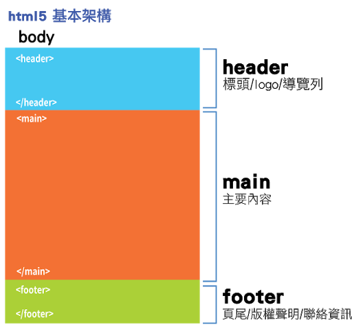
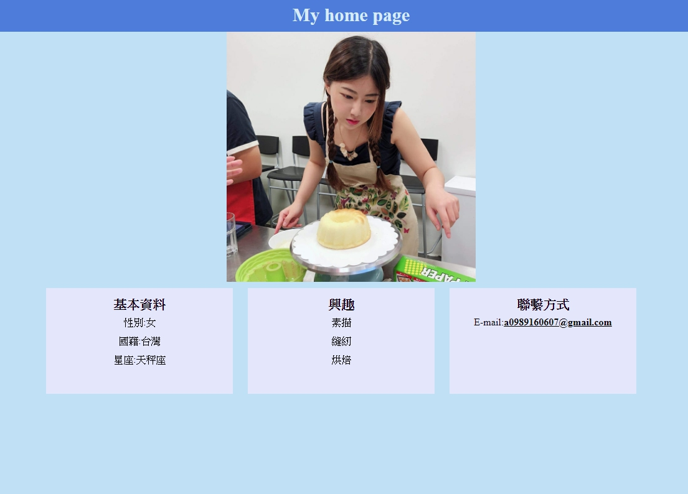

# 網頁前端工程入門：網頁排版教學 By 彭彭

區塊並排、固定高度、版面文字置中

## 學習參考來源

[網頁前端工程入門：網頁排版教學 By 彭彭](https://www.youtube.com/watch?v=YnSmOQF5Lwk&list=RDCMUCguZS-y7codLSt6vpkVdnKg&index=2)

## 學習筆記

一個網頁的呈現通常會包含以下三元素：head, body 與 footer

運行上網頁會從頭到尾的做載入，但如果是顯在 `head` 的內容會全部載入完後才載入 `body` 的.



範例：

```html
<!DOCTYPE html>
<html>
  <head>                                  <!--網頁的描述，通常與網頁的內容無關，負責宣告一些設定與外部檔案的預先載入-->
      <meta charset="utf8"/>              <!--網頁按utf8編碼進行，使中文或是非英文語系的文字可以正確顯示-->
      <title></title>                     <!--網頁的標題(頁面與頁籤）-->
      <style type:"text/css"></style>     <!--此頁所需的 css 內容-->
  </head>
  <body>                                  <!--網頁的頁面內容-->
  </body>
  <footer></footer>                       <!--網頁的聲明內容-->
</html>
```

## 實作

- 呈現如下



- [作品原始碼](/02_basic_html/homework/training2.html)
